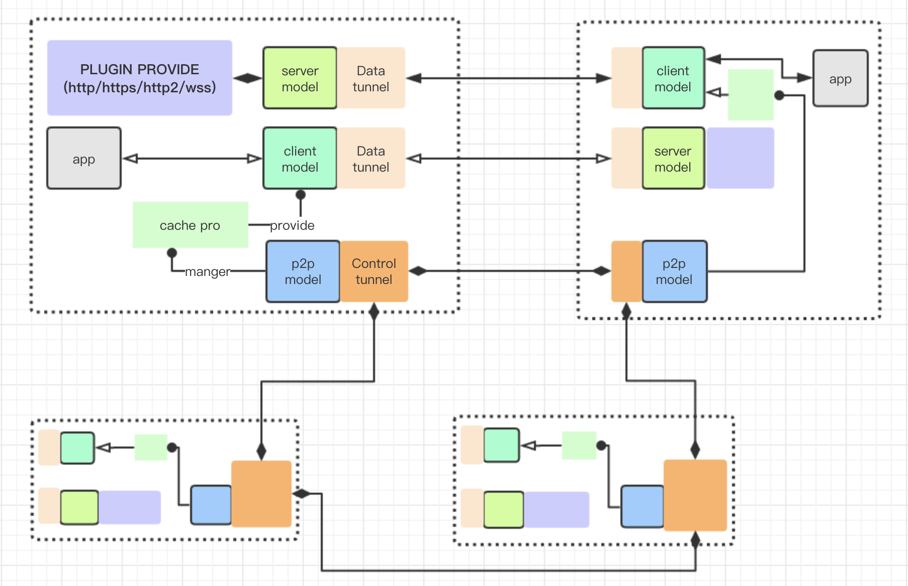

# 👑 Kerrigan

English | [中文](./README_zh.md)

[](./LICENSE)
[](./go.mod)

**Kerrigan** - A Negotiable Decentralized Task Distribution Network

A decentralized resource trading platform built on P2P network and blockchain technology. It enables sharing of compute resources (GPU/Storage/Bandwidth) with transparent pricing via smart contracts and e-CNY payments.

## Architecture



## Client Visualization


## System Architecture

```
┌─────────────────────────────────────────────────────────────┐
│                    Application Layer                         │
│    GPU Plugin  │  Storage Plugin  │  Proxy Plugin         │
├─────────────────────────────────────────────────────────────┤
│                    Plugin Runtime                           │
│    Lifecycle  │  Resource Abstraction  │  Metering          │
├─────────────────────────────────────────────────────────────┤
│                    P2P Network Layer                       │
│    Control Plane  │  Data Plane                              │
├─────────────────────────────────────────────────────────────┤
│                    Blockchain Layer                          │
│    Resource Registry  │  Trading  │  Plugin Registry        │
│                    e-CNY Payment                            │
└─────────────────────────────────────────────────────────────┘
```

## Features

- **P2P Network**: Distributed peer-to-peer architecture with libp2p
- **Plugin System**: Extensible plugin architecture for GPU, Storage, and Proxy resources
- **Blockchain Integration**: Smart contracts for resource registration and trading
- **e-CNY Payments**: Integrated payment system with escrow protection

## Quick Start

### Prerequisites

- Go 1.21+
- Docker (optional)

### Build

```bash
# Clone the repository
git clone git@github.com:Gemrails/kerrigan.git
cd kerrigan

# Install dependencies
make deps

# Build binaries
make build
```

### Run

```bash
# Start provider node
./build/kerrigan-node run --role provider --gpu --storage

# Start as genesis node
./build/kerrigan-node run --genesis
```

### CLI Usage

```bash
# Check node status
./build/kerrigan-cli node status

# List available resources
./build/kerrigan-cli resource list
```

## Plugins

### GPU Plugin
Distributed GPU computing for AI inference, model fine-tuning, and batch processing.

### Storage Plugin
IPFS-based distributed storage with P2P file retrieval.

### Proxy Plugin
Network bandwidth sharing with geo-pricing.

## Project Structure

```
kerrigan/
├── cmd/               # Entry points (node, cli)
├── internal/          # Internal packages
│   ├── core/         # Core modules (network, plugin, resource)
│   ├── chain/        # Blockchain integration
│   └── plugins/      # Built-in plugins (gpu-share, storage, proxy)
├── pkg/              # Public utilities (crypto, log, utils)
├── configs/          # Configuration files
└── media/           # Images and media files
```

## Configuration

Configuration is done via YAML files in `configs/`:

```yaml
# node.yaml
node:
  node_id: ""  # Auto-generated if empty
  roles:
    - provider
  plugins:
    - gpu-share
    - storage

network:
  control_port: 38888
  data_port: 38889
  seed_nodes:
    - /ip4/1.2.3.4/tcp/38888/p2p/Qmxxx

blockchain:
  network: testnet  # mainnet, testnet, local
  payment_contract: "0x..."
```

## Documentation

- [Architecture](docs/ARCHITECTURE_MINDMAP.md)
- [Plugin Development Guide](docs/REFACTOR_PLAN_v2.md)

## License

This project is open source and available under the [MIT License](./LICENSE).
