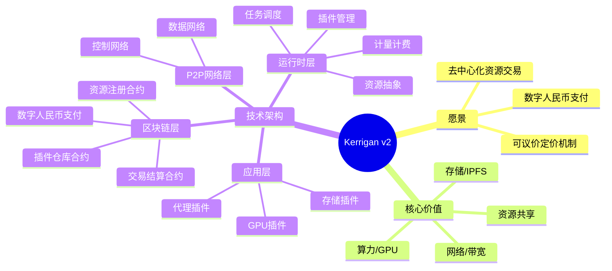
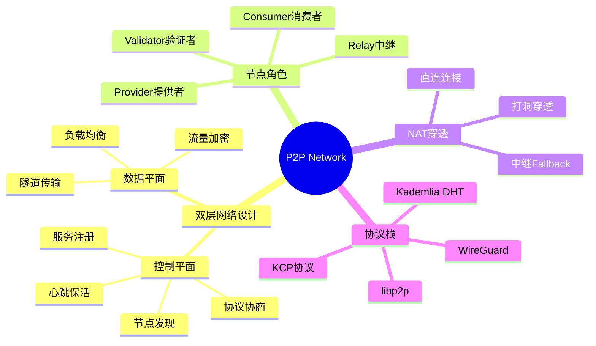
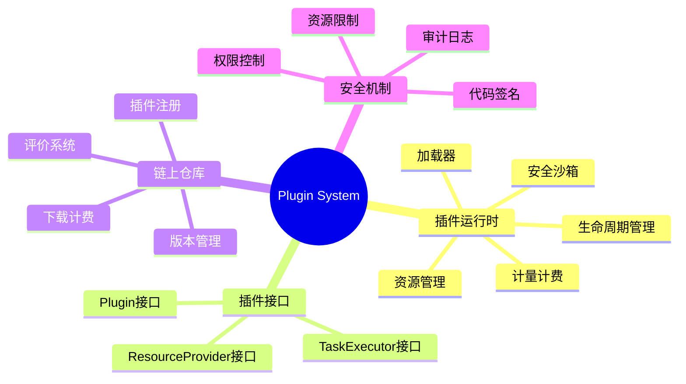
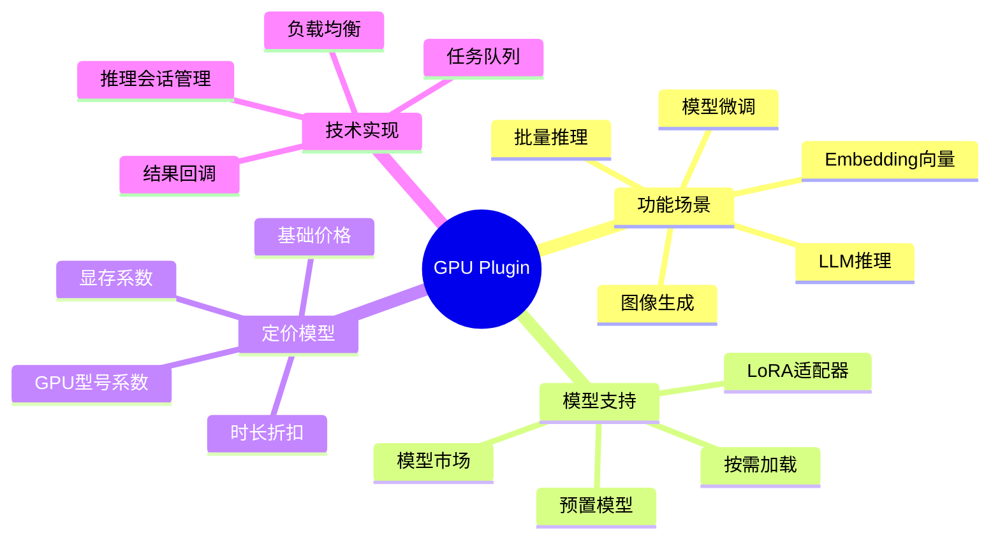
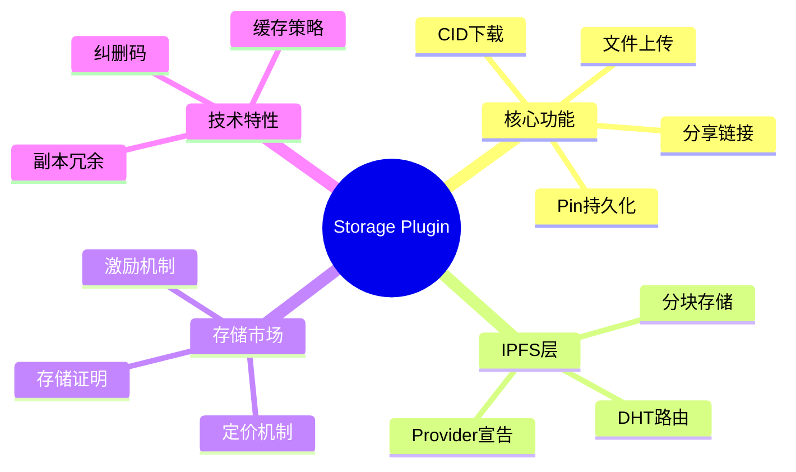
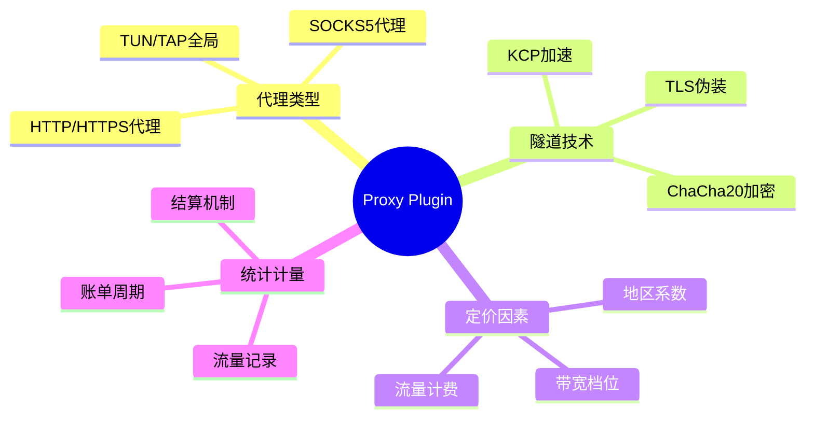
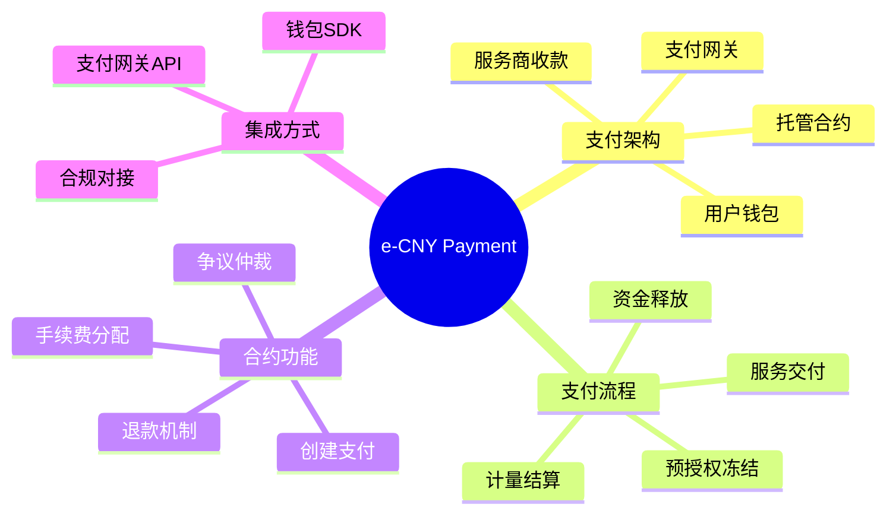
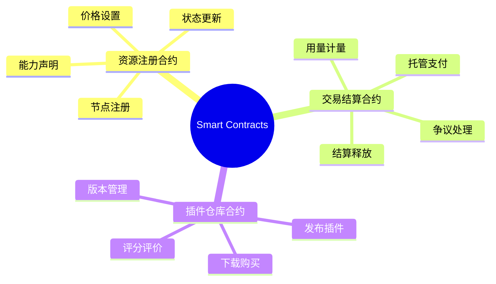
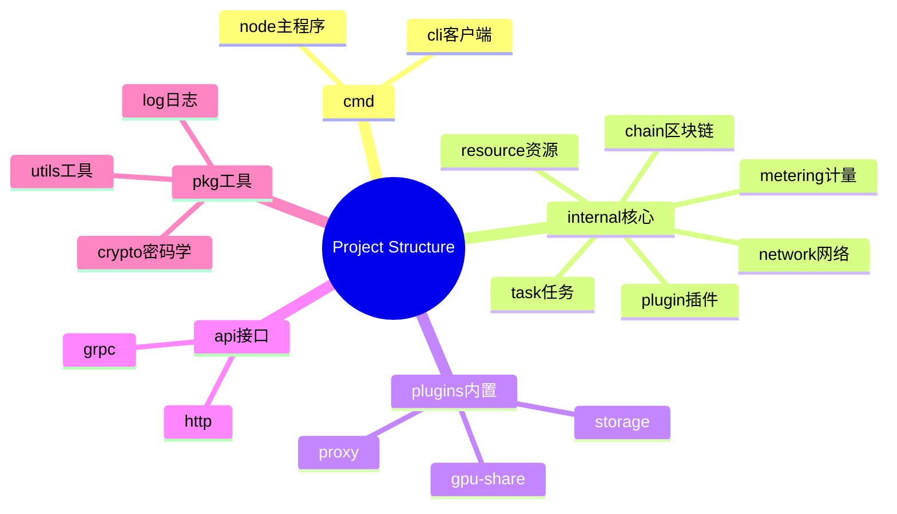
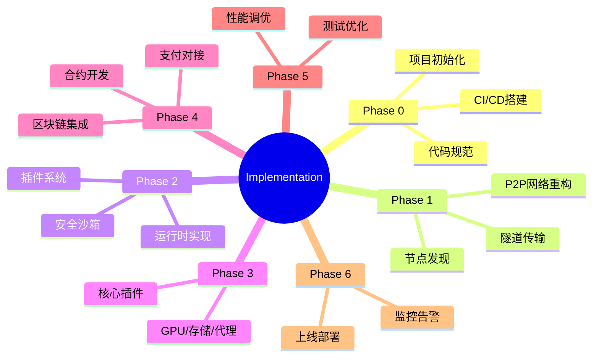

# Kerrigan v2 架构脑图

## 一、整体架构

```mermaid
mindmap
  root((Kerrigan v2))
    愿景
      去中心化资源交易
      可议价定价机制
      数字人民币支付
    核心价值
      资源共享
      算力/GPU
      存储/IPFS
      网络/带宽
    技术架构
      应用层
        GPU插件
        存储插件
        代理插件
      运行时层
        插件管理
        资源抽象
        任务调度
        计量计费
      P2P网络层
        控制网络
        数据网络
      区块链层
        资源注册合约
        交易结算合约
        插件仓库合约
        数字人民币支付
```

## 二、P2P 网络架构

```mermaid
mindmap
  root((P2P Network))
    双层网络设计
      控制平面
        节点发现
        协议协商
        心跳保活
        服务注册
      数据平面
        隧道传输
        负载均衡
        流量加密
    节点角色
      Consumer消费者
      Provider提供者
      Relay中继
      Validator验证者
    NAT穿透
      直连连接
      打洞穿透
      中继Fallback
    协议栈
      libp2p
      Kademlia DHT
      KCP协议
      WireGuard
```

## 三、插件系统

```mermaid
mindmap
  root((Plugin System))
    插件运行时
      加载器
      生命周期管理
      资源管理
      计量计费
      安全沙箱
    插件接口
      Plugin接口
      ResourceProvider接口
      TaskExecutor接口
    链上仓库
      插件注册
      版本管理
      下载计费
      评价系统
    安全机制
      代码签名
      权限控制
      资源限制
      审计日志
```

## 四、GPU 算力插件

```mermaid
mindmap
  root((GPU Plugin))
    功能场景
      LLM推理
      图像生成
      Embedding向量
      模型微调
      批量推理
    模型支持
      预置模型
      模型市场
      LoRA适配器
      按需加载
    定价模型
      基础价格
      GPU型号系数
      显存系数
      时长折扣
    技术实现
      推理会话管理
      负载均衡
      任务队列
      结果回调
```

## 五、分布式存储插件

```mermaid
mindmap
  root((Storage Plugin))
    核心功能
      文件上传
      CID下载
      Pin持久化
      分享链接
    IPFS层
      分块存储
      DHT路由
      Provider宣告
    存储市场
      定价机制
      存储证明
      激励机制
    技术特性
      副本冗余
      纠删码
      缓存策略
```

## 六、网络代理插件

```mermaid
mindmap
  root((Proxy Plugin))
    代理类型
      HTTP/HTTPS代理
      SOCKS5代理
      TUN/TAP全局
    隧道技术
      KCP加速
      TLS伪装
      ChaCha20加密
    定价因素
      地区系数
      带宽档位
      流量计费
    统计计量
      流量记录
      账单周期
      结算机制
```

## 七、数字人民币支付

```mermaid
mindmap
  root((e-CNY Payment))
    支付架构
      用户钱包
      托管合约
      支付网关
      服务商收款
    支付流程
      预授权冻结
      服务交付
      计量结算
      资金释放
    合约功能
      创建支付
      争议仲裁
      退款机制
      手续费分配
    集成方式
      支付网关API
      钱包SDK
      合规对接
```

## 八、区块链合约

```mermaid
mindmap
  root((Smart Contracts))
    资源注册合约
      节点注册
      能力声明
      价格设置
      状态更新
    交易结算合约
      托管支付
      用量计量
      结算释放
      争议处理
    插件仓库合约
      发布插件
      版本管理
      下载购买
      评分评价
```

## 九、项目结构

```mermaid
mindmap
  root((Project Structure))
    cmd
      node主程序
      cli客户端
    internal核心
      network网络
      plugin插件
      resource资源
      task任务
      metering计量
      chain区块链
    plugins内置
      gpu-share
      storage
      proxy
    api接口
      grpc
      http
    pkg工具
      crypto密码学
      utils工具
      log日志
```

## 十、实施计划

```mermaid
mindmap
  root((Implementation))
    Phase 0
      项目初始化
      CI/CD搭建
      代码规范
    Phase 1
      P2P网络重构
      节点发现
      隧道传输
    Phase 2
      插件系统
      运行时实现
      安全沙箱
    Phase 3
      核心插件
      GPU/存储/代理
    Phase 4
      区块链集成
      合约开发
      支付对接
    Phase 5
      测试优化
      性能调优
    Phase 6
      上线部署
      监控告警
```

---

*生成时间: 2026-04-01*
